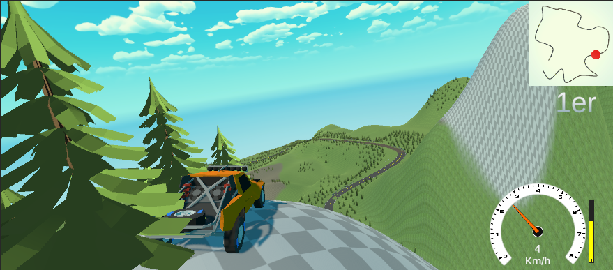

# LioRally
Un jeu de simulation de course rally. Ce projet, créé par 4 étudiants enthousiastes, simule les comportements des véhicules de la vrai vie et mets le joueur à l'épreuve dans un contexte de course contre des intelligences artificielles.

## Fonctionnalités Principales

- **Simulation Réaliste :** Le jeu offre une expérience immersive en reproduisant fidèlement les comportements des véhicules, leur physique et les conditions de course.
  
- **Intelligences Artificielles :** Des adversaires IA compétitifs créent des défis dynamiques et réactifs pour les joueurs, ajoutant une dimension stratégique à chaque course.

- **Diversité des Pistes :** Des circuits variés offrent des défis uniques, allant des environnements urbains aux terrains accidentés en passant par des conditions météorologiques changeantes.

## Code du Projet

Ce projet a été développé principalement en utilisant le langage C#. Voici quelques détails sur les fonctionnalités que j'ai implémentées :

### Utilisation des Splines pour la Physique des Circuits

Ces calculs de distances le long des splines sont fondamentaux pour la gestion précise de la physique des circuits. Ils sont utilisés pour déterminer les trajectoires des véhicules, calculer les collisions potentielles et gérer la logique de course, contribuant ainsi à une expérience réaliste pour les joueurs.

### Calcul des Distances via Splines

Une des fonctionnalités clés que j'ai développées concerne le calcul précis des distances entre différents éléments du jeu en suivant les splines des circuits. Cette fonctionnalité repose sur des algorithmes spécifiques permettant de déterminer les distances le long des courbes définies par ces splines.

### Intégration à l'Interface Utilisateur (IU)

En plus des aspects techniques, j'ai également contribué à l'intégration de ces fonctionnalités dans l'interface utilisateur. Cela inclut la visualisation des calculs de distances et la représentation graphique des trajectoires basées sur les splines, offrant ainsi une expérience visuelle immersive aux joueurs.
